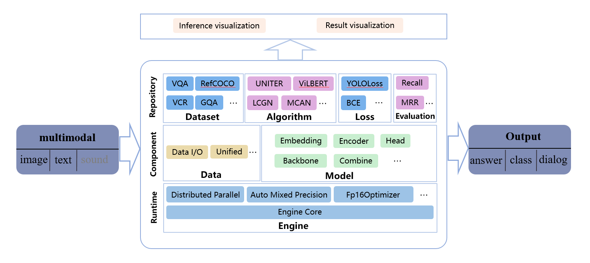

<div align="center">
  
</div>

## 简介

[English](readme.md) | 简体中文

浪潮多模态智能应用框架（简称iMIX）是一个用于实现多模态智能的系统。本框架基于开箱即用的设计理念，兼容丰富的多模态任务、数据集和模型，具备可扩展性、易用性和高性能，可作为一站式多模态智能研究和应用平台。

iMIX主要工作是基于PyTorch。

Documentation: https://imix-docs.readthedocs.io/en/latest/



## 开源许可证

该项目采用 [Apache 2.0 开源许可证](LICENSE)。

## 更新日志

iMIX v0.1.0支持主流多模态数据集、多模态模型、混合精度训练和多机多卡分布式训练等。

后续iMIX将针对框架进一步优化，增加更多双流单流预训练模型，统一数据读取流程，并增加mask、回译、无监督等数据增强方法，以及支持多个任务同时训练。

## 基准测试和模型库

测试结果和模型可以在[模型库](docs/getstart/model_zoo.md)中找到。

所有支持的模型和任务如下表所示：

| task              | LXMERT | UNITER | ViLBERT | DeVLBert | Oscar | VinVL | MCAN | LCGN | HGL  | R2C  | VisDial-BERT |
| ----------------- | ------ | ------ | ------- | -------- | ----- | ----- | ---- | ---- | ---- | ---- | ------------ |
| VQA               | √      | √      | √       | √        | √     | √     | √    |      |      |      |              |
| GQA               | √      |        | √       |          | √     | √     |      | √    |      |      |              |
| NLVR              | √      | √      |         |          | √     | √     |      |      |      |      |              |
| VQA_large         |        |        |         |          | √     |       |      |      |      |      |              |
| NLVR_large        |        |        |         |          | √     | √     |      |      |      |      |              |
| GussWhatPointing  |        |        | √       |          |       |       |      |      |      |      |              |
| VisualEntailment  |        | √      | √       |          |       |       |      |      |      |      |              |
| GussWhat          |        |        | √       |          |       |       |      |      |      |      |              |
| VCR_QAR           |        |        |         | √        |       |       |      |      | √    | √    |              |
| VCR_QA            |        |        |         | √        |       |       |      |      | √    | √    |              |
| Visual7w          |        |        | √       |          |       |       |      |      |      |      |              |
| RetrivalFlickr30k |        |        | √       |          |       |       |      |      |      |      |              |
| GenomeQA          |        |        | √       |          |       |       |      |      |      |      |              |
| Retrivalcoco      |        |        | √       |          |       |       |      |      |      |      |              |
| refcocog          |        |        | √       |          |       |       |      |      |      |      |              |
| refcoco           |        |        | √       |          |       |       |      |      |      |      |              |
| refcoco+          |        |        | √       | √        |       |       |      |      |      |      |              |
| VisDial           |        |        |         |          |       |       |      |      |      |      | √            |

## 安装

请参考[快速入门文档](docs/getstart/get_started.md)进行安装。

## 快速入门

请参考[新手使用指南](docs/Quickrun/1_exist_data_model.md)学习 iMIX 的基本使用和可视化推理界面。

我们提供了框架核心功能 [engine介绍](docs/tutorials/Tutorial-engine.md)，基本配置[config介绍](docs/tutorials/Tutorial1-config.md)，以及包含的所有[模型和精度介绍](docs/getstart/model_zoo.md)。

我们也提供了一些进阶教程，内容覆盖了 [finetune 模型](docs/tutorials/Tutorial6-finetune.md)，[增加新数据集支持](docs/tutorials/Tutorial2-customize_dataset.md)，[增加自定义模型](docs/tutorials/Tutorial3-customize_models.md)，[增加自定义的运行时配置](docs/tutorials/Tutorial4-customize_Schedule_and_Runtime_Settings.md)，[常用工具](docs/log_visualization.md)。

## 贡献指南

我们感谢所有的贡献者为改进和提升 iMIX 所作出的努力。请参考[贡献指南](CONTRIBUTING.md)来了解参与项目贡献的相关指引。

## 致谢

iMIX 是一款由浪潮集团的研发人员共同参与贡献的开源项目。我们感谢所有为项目提供算法复现和新功能支持的贡献者，以及提供宝贵反馈的用户。 我们希望这个工具箱和基准测试可以为社区提供灵活的代码工具，供用户复现已有算法并开发自己的新模型，从而不断为开源社区提供贡献。

## 引用

如果你在研究中使用了本项目的代码或者性能基准，请参考如下引用 iMIX。

```
@misc{fan2021iMIX,
  author =       {Baoyu Fan, Liang Jin, Runze Zhang, Xiaochuan Li, Cong Xu, Hongzhi Shi, Jian Zhao, Yinyin Chao, Yingjie Zhang, Binqiang Wang, Zhenhua Guo, Yaqian Zhao, Rengang Li},
  title =        {iMIX: A multimodal framework for vision and language research},
  howpublished = {\url{https://github.com/inspur-hsslab/iMIX}},
  year =         {2021}
}
```