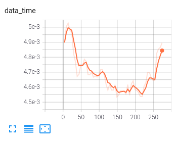
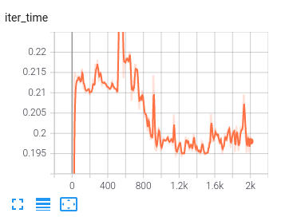
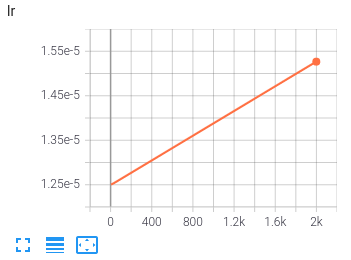
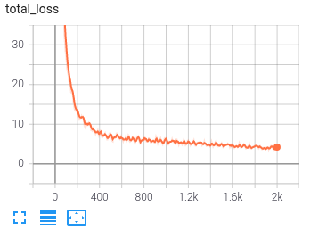
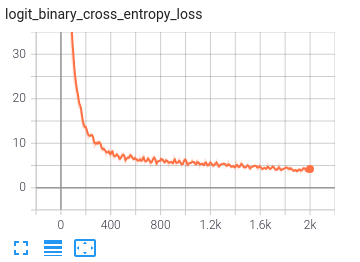

# Log Visualization

The utility let you log PyTorch models and metrics into a directory for visualization with the TensorBoard. Such as, visualizing the fluctuate trend of the load data time, the iter time, the model loss, the total loss, the learning rate and etc.

There are two steps to visualize your data:

1. use log_buffer to generate `imix/tools/work_dirs/runs`  of your data;
2. use TensorBoard to generate scalar/image/histogram of your data.

## Output Runs

First you should make sure which directory your data is in:

1. if your data is in `imix/engine/hooks`, like the `lr` of  in the `imix/engine/hooks/lr_scheduler.py`, you can add the following line below the `lr`.

   ```python
   @HOOKS.register_module()
   class LRSchedulerHook(HookBase):
       ...
       def _record_lr_log(self):
           lr = self._optimizer.param_groups[self._best_param_group_idx]['lr']
           self.trainer.log_buffer.put_scalar('lr', lr, smoothing_hint=False)
   ```

2. if your data is in other place of `imix/engine`, like the `loss` of the `output` in the `imix/engine/imix_engine.py`, you can add the following line below the `output`.

   ```python
   class CommonEngine(EngineBase):
       ...
       def run_train_iter(self):
           ...
           self.output = self.loss_fn(self.model_output)
           # add the following line to visualize the logits
           self.log_buffer.put_scalar('loss', self.output['loss'].item(), smoothing_hint=False)
   ```

3. if your data is in other directory under `imix`, like the `logits` in the `imix/models/encoder/lxmert.py`, you can add the following line below the `logits`.

   ```python
   @ENCODER.register_module()
   class LXMERTForClassification(nn.Module):
        def forward(
            ...
            logits = self.classifier(pooled_output)
            # add the following line to visualize the logits
            from .log_buffer_imix import get_log_buffer
            logger_buffer = get_log_buffer()
            logger_buffer.put_scalar('logits', logits, smoothing_hint=False)
   ```

## Visualize Runs

After the steps above, the data can then be visualized with TensorBoard,  the commands are as below:

```
pip install tensorboard
cd imix/tools/work_dirs
tensorboard --logdir=runs
```

Example result:










