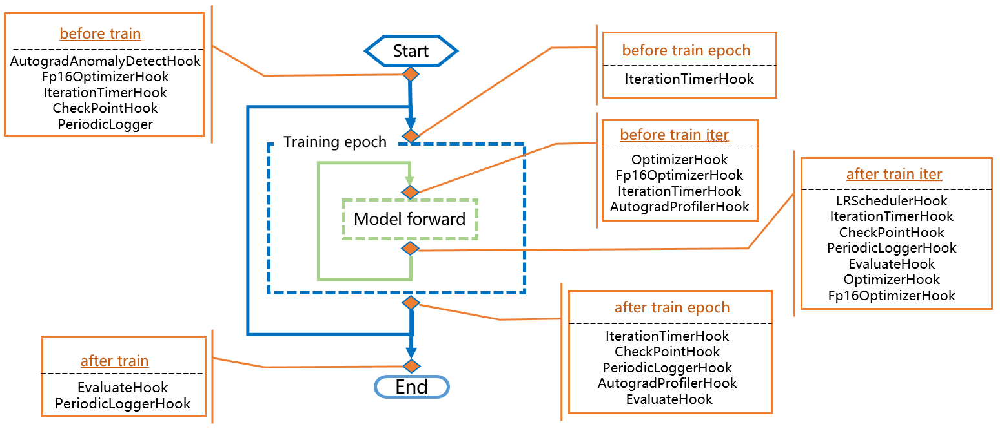
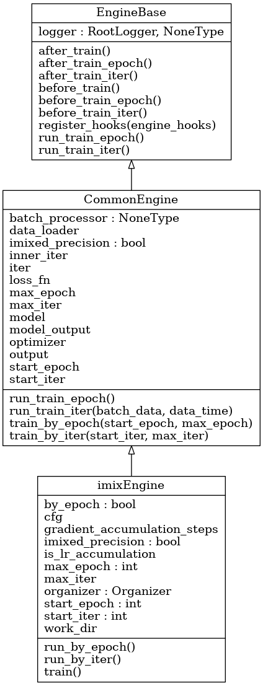
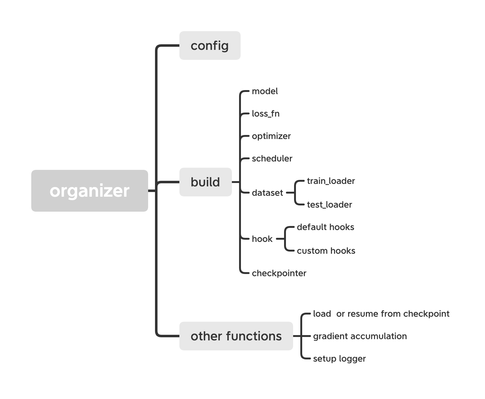

# Tutorial: Engine

**Engine** is the core module of the iMIX framework. It organizes each part of the deep learning process, including data, models, optimizers, lr_scheduler and so on. The whole process of Engine is as follows.

Engine is mainly composed of **imixEngine** and **hooks**. The former is used to control the whole process of deep learning training, verification and testing, in which the process is highly abstracted and modularized into several stages; the latter is in charged of specific calculation, such as `autograd_anomally_detect`, `lr_scheduler`, `iteration_time`,`periodic_logger`,  `evaluate` and so on (For more details, please refer to the [Tutorial5](Tutorial5-customize_hooks.md)).

**imixEngine**  has two levels of inheritance, which are **CommonEngine** and **EngineBase**. The inheritance relationship of the three class is shown in the figure below.

**EngineBase** is parent class. It abstracts the whole process into 8 parts, including 6 parts used for running hooks (`before_train`, `after_train`, `before_train_iter`, `after_train_iter`, `before_train_epoch` and  `after_train_epoch`) and 2 parts for train (`run_train_epoch` or `run_train_iter`).

**CommonEngine** inherits from EngineBase.

+ It builds 2 kinds of train modes with the 8 parts of **EngineBase**, which are as `run_by_epoch` and `run_by_iter`;

| run_by_epoch         | run_by_iter         |
| :------------------- | :------------------ |
| before_train()       | before_train()      |
| before_train_epoch() | before_train_iter() |
| before_train_iter()  | run_train_iter()    |
| run_train_iter()     | after_train_iter()  |
| after_train_iter()   | after_train()       |
| after_train_epoch()  | /                   |
| after_train()        | /                   |

+ In the core part `run_train_iter`, it computes `forward train`, `loss` and update the metrics result.

**imixEngine** inherits from CommonEngine. It builds necessary modules by **Organizer** and choose the train mode. The details are as follows:

- By **Organizer**, it build data_loader, model, optimizer, hooks and so on. And it gets params like start_iter, max_iter and other attributes.

  

- In imixEngine, it provides two training iteration methods based on epoch or iter. Users can set `by_iter `parameters true or false to switch training method flexibly.
