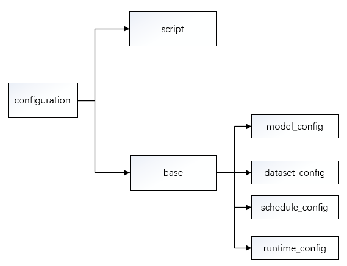
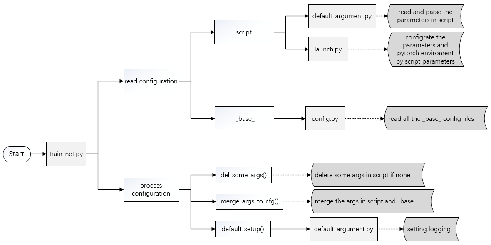

# Tutorial 1: Learn about Configs

In iMIX, we provide you with multiple models, datasets, schedules configs and default runtime setting. Users can update parameter value by command line. And all the config information will be saved to `tools/work_dirs/config.json` and print on the console when you run task if you want to have a check.

## The configuration

The configuration include two parts: the script and the `_base_`, which is as follow:



### The script configuration

Before submitting jobs using `tools/run.py`, you may specify some argument through script. You can get help of all arguments by running

```shell
python tools/run.py --h  # run script
```

which are shown as belows:

```shell
python tools/run.py --h  # run script

usage: run.py [-h] [--config-file FILE] [--resume-from RESUME_FROM]
                    [--load-from LOAD_FROM] [--eval-only] [--build-submit]
                    [--gpus GPUS] [--machines MACHINES]
                    [--node-rank NODE_RANK] [--work-dir WORK_DIR]
                    [--seed SEED] [--master-port MASTER_PORT]
                    [--master-addr MASTER_ADDR]

optional arguments:
  -h, --help            show this help message and exit
  --config-file FILE    train config file path
  --resume-from RESUME_FROM
                        resume from the checkpoint file
  --load-from LOAD_FROM
                        load from the checkpoint file
  --eval-only           just run evaluation
  --build-submit        generate submission results
  --gpus GPUS           the number of gpus on each machine
  --machines MACHINES   the total number of machine to use
  --node-rank NODE_RANK
                        the rank of current node(unique per machine)
  --work-dir WORK_DIR   the dir to save logs and models
  --seed SEED           random seed
  --master-port MASTER_PORT
                        it is the free port of mast node(rank 0) and is used
                        for communication in distributed training
  --master-addr MASTER_ADDR
                        the IP address of mast node(rank 0)
```

### The `_base_` config file

Before submitting jobs using `tools/run.py`, you also need to specify the `_base_`config file. Use MCAN model as an example. And assume that you want to do VQA task, then you should set as

```shell
python tools/run.py --config-file  yourpath/imix/configs/MCAN/mcan_vqa.py
```

The `mcan_vqa.py` config file path is as below:

```plain
imix
├── configs
│   ├── mcan
│   │   ├── mcan_vqa.py
│   │   ├── ...
│   ├── ...
├── demo
├── ...
```

And in the `mcan_vqa.py`, we set the `_base_ ` config as below:

```
_base_ = [
    '../_base_/models/mcan_config.py',
    '../_base_/datasets/vqa_dataset_grid_data.py',
    '../_base_/schedules/schedule_vqa.py',
    '../_base_/default_runtime.py'
]
```

There are 4 component in the `_base_ ` config, which are corresponds to the four basic component under `config/_base_`: datasets, models, schedules, default_runtime. Many methods could be easily constructed with one of each in models.

```plain
imix
├── configs
│   ├── _base_
│   │   ├── datasets
│   │   │   ├── vqa_dataset_grid_data.py
│   │   │   ├── ...
│   │   ├── models
│   │   │   ├── mcan_config.py
│   │   │   ├── ...
│   │   ├── schedules
│   │   │   ├── schedule_vqa.py
│   │   ├── default_runtime.py
│   ├── mcan
│   │   ├── mcan_vqa.py
│   │   ├── ...
│   ├── ...
├── demo
├── ...
```

If you are building an entirely new method that does not share the config with any of the existing methods, you may do the following steps:

1. Create a folder `xxx` under `configs` , like `mcan`.

2. Add the module in that folder to specify the `_base_`.

3. Add the new configs under the four basic components if necessary, such as:
   - add the corresponding `model.py` under `configs/_base_/models/`;
   - modify or add the `dataset.py`  under `configs/_base_/datasets/`;
   - modify or add the `schedule.py` under `configs/_base_/schedules/`.

## Configuration Reading Process

the script path should be set as `your_path/imix/tools/run.py`. In the run, it will finish the following steps as follows:

1. read and parse the parameters in script;
2. configrate the parameters and pytorch enviroment by script parameters;
3. read all the _base_ config files;
4. delete some args in script if none;
5. merge the args in script and _base_;
6. setting logging.



The code about the config in the run.py is as follows:

```python
def del_some_args(args):
    if args.seed is None:
        del args.seed
    if args.work_dir is None:
        del args.work_dir
    if not args.load_from:
        del args.load_from
    if not args.resume_from:
        del args.resume_from


def merge_args_to_cfg(args, cfg):
    for k, v in vars(args).items():
        cfg[k] = v


def init_set(args):
    cfg = imix_config.fromfile(args.config_file)  # read all the _base_ config files
    del_some_args(args)  # delete some args in script if none
    merge_args_to_cfg(args, cfg)  # merge the args in script and _base_
    default_setup(args, cfg)  # setting logging

    return cfg


def main(args):
    cfg = init_set(args)
    if cfg.eval_only:
        return test(cfg)
    else:
        return train(cfg)


if __name__ == '__main__':
    args = default_argument_parser().parse_args()  # read and parse the parameters in script
    print('Command line Args:', args)
    ddp_launch(
        run_fn=main,
        gpus=args.gpus,
        machines=args.machines,
        master_addr=args.master_addr,
        master_port=args.master_port,
        run_fn_args=(args, ))
```

## FAQ

### Use common variables in configs

Some common variables are used in the configs files, like `train_data`,`test_data`,`post_processor` in datasets.
It's worth noting that when modifying common variables in the children configs, user need to pass the common variables into corresponding fields again.
The common variables in the `vqa_dataset.py` are as below.

```python
train_data = dict(
    samples_per_gpu=4,
    workers_per_gpu=1,
    sampler_name='TrainingSampler',
    data=dict(
        type=dataset_type,
        reader=vqa_reader_train_cfg,
        info_cpler=vqa_info_cpler_cfg,
        limit_nums=400))

test_data = dict(
    samples_per_gpu=16,
    workers_per_gpu=1,
    sampler_name='TestingSampler',
    data=dict(
        type=dataset_type,
        reader=vqa_reader_test_cfg,
        info_cpler=vqa_info_cpler_cfg),
    eval_period=5000)

post_processor = dict(
    type='Evaluator',
    metrics=[dict(type='VQAAccuracyMetric')],
    dataset_converters=[dict(type='VQADatasetConverter')])
```

We first define the new `train_data`/`test_data`/`post_processor`and pass them into `data`.
