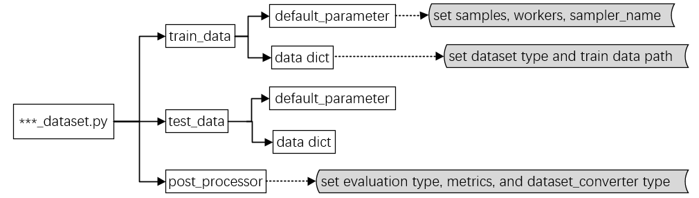
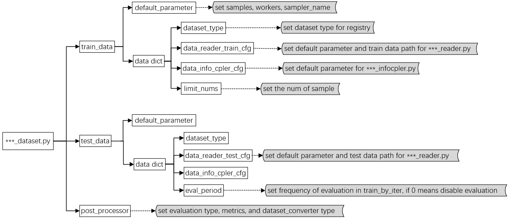

# Tutorial 2: Customize Datasets

There are two choices when you customize dataset:

1. use the dataset read and process module of the source code;
2. use iMIX dataset read and process module.

Next, we will introduce two cases in detail. There must be three steps in either case.

1. Download dataset files;
2. Prepare the dataset config file;
3. Prepare dataset process pipeline.

## Customize dataset in source code

### Download dataset files

Download the related data files of the source code.  Use LXMERT model and VQA task as an example, we download the `train.json`, `trainval_ans2label.json`, `train2014_obj36.tsv` and so on. And then we put all those files outside the project directory and symlink the dataset root to `imix/configs/_base_/datasets/lxmert/lxmert_vqa.py`.

#### Prepare the dataset config file

Each dataset config file should include three basic elements: `train_data`, `test_data`, `post_processor`.

The structure dataset configuration and the function of each part are as follows：



You should write the dataset configuration to the expected format above and save it in the `imix/configs/_base_/datasets/lxmert/lxmert_vqa.py`.

#### Dataset process pipeline

Use the source code data read and process module (i.e`imix/models/vqa_models/lxmert/datasets/lxmert_vqa.py`).

There are some key point you should do before using the functions of the class in source code:

- import the `DATASETS` register;
- decorate the dataset class by `@DATASETS.register_module()` to register it;

```python
from imix.data.builder import DATASETS  # import the DATASETS register

@DATASETS.register_module()
class VQATorchDataset(Dataset):
    def __init__(self, reader):
        ...

    def __len__(self):
        return len(self.data)

    def __getitem__(self, item: int):
        ...
        return item
```

- add your dataset type in the `imix/data/_init_.py` before use it;

```python
import ...
__all__ = [
    'VQATorchDataset',  # add the dataset_type in the list
    ...
]
```

## Customize dataset in iMIX

### Download dataset files

In iMIX, we directly use the  extracted data files refer to the source code paper.

Use VQA dataset as an example, we download the `trainval2014.lmdb`, `imdb_train2014.npy`, `imdb_minival2014.npy` and etc. And then we put all those files outside the project directory and symlink the dataset root to `imix/configs/_base_/datasets`.

### Prepare the dataset config file

Each dataset config file should include three basic elements: `train_data`, `test_data`, `post_processor`.

The structure of iMIX dataset configuration and the function of each part are as follows：



**Note**: In iMIX, the`data_info_cpler_cfg` is used for data preprocessing.

You should write the dataset configuration to the expected format above and save it in the `imix/configs/_base_/datasets/your_dataset.py`. The file path is as below:

```plain
imix
├── configs
│   ├── _base_
│   │   ├── datasets
│   │   │   ├── vqa_dataset.py
│   │   │   ├── your_dataset.py
│   │   │   ├── ...
```

#### An example of data configuration

To help the users have a basic idea of a complete dataset config, we make  brief comments on the VQA dataset config as the following.

```python
# set dataset type for registry
dataset_type = 'VQADATASET'
# set dataset path for root, feature, annotation, vocab, etc
data_root = 'your_path'
...
# set dataset category, like ‘train’, ‘minival’, etc
train_datasets = ['train']
...
# set default parameter and train data path for vqa_reader.py
vqa_reader_train_cfg = dict(
    type='VQAReader',
    card='default',
    mix_features=dict(
        train=data_root + feature_default_path + 'trainval2014.lmdb',
        ...),
    ...
    datasets=train_datasets,
    if_global=False,
)
# set default parameter and test data for vqa_reader.py
vqa_reader_test_cfg = dict(...)
# set default parameter and test data for vqa_infocpler.py
vqa_info_cpler_cfg = dict(...)

# set default config for train data
train_data = dict(
    samples_per_gpu=8,
    workers_per_gpu=1,
    sampler_name='TrainingSampler',
    data=dict(type=dataset_type, reader=vqa_reader_train_cfg, info_cpler=vqa_info_cpler_cfg, limit_nums=2000))

# set default config for test data
test_data = dict(...)  # eval_period set to 0 to disable

# set default config for post_processor, like evaluation type, metrics, and dataset_converter type
post_processor = dict(
    type='Evaluator', metrics=[dict(type='VQAAccuracyMetric')], dataset_converters=[dict(type='VQADatasetConverter')])
```

### Dataset process pipeline

The dataset will be prepared ready for train or test by several modules with the configs in `***_dataset.py`, use train mode as an example:

1. register the type by `registry.py`, including dataset type, data_reader_train_cfg type, data_info_cpler type in `***_dataset.py`;
2. prepare the data for train by `***_loader.py`:
   - get the params of the `***_reader_train_cfg` and load the feature and annotation from disk to memory by `***_reader.py`;
   - get the params of the `***_info_cpler_cfg`  and preprocess these data in  `***_infocpler.py`;
   - choose the specific data items for different tasks.

There you should customize three necessary files: `***_loader.py`, `***_reader.py` and `***_infocpler.py` in the process.

The data file structure is as below (use VQA dataset as an example in the following content, the necessary files include `vqa_loader.py`, `vqa_reader.py`, and `vqa_infocpler.py`.):

```plain
imix
├── configs
├── imix
│   ├── data
│   │   ├── _init_.py
│   │   ├── loaders
│   │   │   ├── vqa_loader.py
│   │   ├── reader
│   │   │   ├── _init_.py
│   │   │   ├── vqa_reader.py
│   │   ├── infocomp
│   │   │   ├── _init_.py
│   │   │   ├── vqa_infocpler.py
│   ├── ...
├── ...
```

#### add dataset_loader.py

build your dataset_loader.py as vqa_loader.py, the key point is as follows:

- import the VQAReader and VQAInfoCpler in the `imix/data/loaders/vqa_loader.py`;
- the class `VQADATASET` should inherit from the parent class `BaseLoader` and register the dataset by decorator `@DATASETS.register_module()`;
- writer the specific item dictionary in the `__getitem__()` function according to different task.

```python
# import datasetReader and datasetInfoCpler
from ..reader.vqa_reader import VQAReader as Reader
from ..infocomp.vqa_infocpler import VQAInfoCpler as InfoCpler


#register your dataset module
@DATASETS.register_module()
class VQADATASET(BaseLoader):

    def __init__(self, reader, info_cpler, limit_nums=None):
        super().__init__(Reader, reader, InfoCpler, info_cpler, limit_nums)

    def __getitem__(self, idx):
        item_feature = self.reader[idx]
        item_feature = self.infocpler.completeInfo(item_feature)
        # choose the items for different tasks
        item = {...}
        return item
```

- add your dataset type in the `imix/data/_init_.py` before use it;

```python
from .builder import build_imix_test_loader, build_imix_train_loader
from .loaders.vqa_loader import VQADATASET
import ...
__all__ = [
    'VQADATASET',  # add the dataset_type in the list
    ...
]
```

#### add dataset_reader.py

- Import the dataset reader class  in the `imix/data/reader/_init_.py`;


```python
from .vqa_reader import VQAReader
```

build your dataset_reader.py as vqa_reader.py, the key point is as follows:

- the `VQAReader` should inherit from the parent class `IMIXDataReader` . It will read the parameters of the `vqa_reader_train_cfg` in the parent class;
- write the `__getitem__()` function according to different task.

```python
from .base_reader import IMIXDataReader
...

# inherit from the parent class
class VQAReader(IMIXDataReader):

    def __init__(self, cfg):
        super().__init__(cfg)  # get the params of the `vqa_reader_train_cfg`

    def __len__(self):
        return len(self.mix_annotations)

    # writer the getitem function according to different task.
    def __getitem__(self, item):
        ...
        return item_feature

```

#### add dataset_infocpler.py

Import the dataset infocpler class  in the `imix/data/infocomp/_init_.py`.

```python
from .vqa_infocpler import VQAInfoCpler
```

build your dataset_infocpler.py as vqa_infocpler.py, the key point is as follows:

- the `VQAInfoCpler` should inherit from the parent class `BaseInfoCpler` . It will read the parameters of the `vqa_info_cpler_cfg` in the parent class;
- write `completeInfo` function according to different task.

```python
from .base_infocpler import BaseInfoCpler
...

# inherit from the parent class
class VQAInfoCpler(BaseInfoCpler):

    def __init__(self, cfg):
        super().__init__(cfg)  # get the params of the `vqa_info_cpler_cfg` and preprocess the data

    # writer completeInfo function according to different task
    def completeInfo(self, item_feature: ItemFeature):
        ...

```
