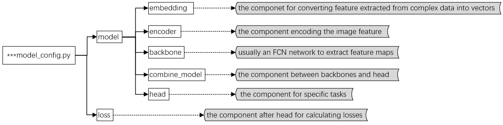

# Tutorial 3: Customize Models

In iMIX, we support two kinds of model structure: BERT-Base style model and others. And there are two chooses when you customize model:

1. use the source code model;
2. use iMIX model sturcture.

## Customize model in source code

Use LXMERT (BERT-Base style model) model as an example in the following content. You should customize one necessary file `imix/models/vqa_models/lxmert/lxmert_task.py`

There are some key point you should do before using the model of source code:

- import the `VQA_MODELS` register and BaseModel;
- decorate the LXMERT class by `@VQA_MODELS.register_module()` to register it;

- the class `LXMERT` should inherit from the parent class `BaseModel` ;

```python
from imix.models.builder import VQA_MODELS   # import the VQA_MODELS register

from imix.models.vqa_models.base_model import BaseModel  # import BaseModel

# inherit from the parent class and register the model
@VQA_MODELS.register_module()
class LXMERT(BaseModel):

    def __init__(self, **kwargs):
        super().__init__()
        ...

    # writer the specific `forward_train` and `forward_test` according to your task
    def forward_train(self, data, **kwargs):
        pass

    def forward_test(self, data, **kwargs):
        pass
    ...
```

## Customize model in iMIX style

In the following part of this tutorial, we introduce how to customize model of non BERT-Base style.

In iMIX, We basically categorize model components into 6 types: embedding, encoder, backbone, combine_model, head and loss, which are as the follows:




There are many options for each component, you could choose one or more from each component to build up a model according to your task.

| componet      | option                                                       |
| ------------- | ------------------------------------------------------------ |
| embedding     | 'WordEmbedding', 'TextEmbedding', ...                        |
| encoder       | 'ImageFeatureEncoder', 'LCGNEncoder', ...                    |
| backbone      | 'HGL_BACKBONE', 'TwoBranchEmbedding', 'R2C_BACKBONE', 'LCGN_BACKBONE', ... |
| combine_model | 'BranchCombineLayer', 'ModalCombineLayer',...                |
| head          | 'R2CHead', 'TripleLinearHead', 'LCGNClassiferHead', ...      |
| loss          | 'TripleLogitBinaryCrossEntropy', 'CrossEntropyLoss', 'OBJCrossEntropyLoss', ... |

### Build up model

You can build up model by the components above. Next we will introduce how to build up model in detail, use MCAN model as an example in the following content.

#### Customize the model.py

There you should customize one necessary file `imix/models/vqa_models/mcan_imix.py` to build your model, the key point is as follows:

- import the choosed components and BaseModel in the `imix/models/vqa_models/mcan_imix.py`;
- the class `MCAN` should inherit from the parent class `BaseModel` and register the model by decorator `@VQA_MODELS.register_module()`;
- build instantiate object of the componet in the `__init__` function;
- writer the specific `forward_train` and `forward_test` function according to your task.

```python
# import the choosed components and BaseModel
from ..builder import VQA_MODELS, build_backbone, build_combine_layer, build_embedding, build_encoder, build_head

from .base_model import BaseModel

# inherit from the parent class and register the model
@VQA_MODELS.register_module()
class MCAN(BaseModel):
     def __init__(self, embedding, encoder, backbone, combine_model, head):
        super().__init__()
        # build instantiate object of the componet
        self.embedding_model = build_embedding(embedding)
        self.encoder_model = build_encoder(encoder)
        self.backbone = build_backbone(backbone)
        self.combine_model = build_combine_layer(combine_model)
        self.head = build_head(head)

    # writer the specific `forward_train` and `forward_test` according to your task
    def forward_train(self, data, **kwargs):
        pass

    def forward_test(self, data, **kwargs):
        pass
    ...
```

### Develop new components

If the existing component option can not meet your needs, you can add a new one for your task. Here we show how to develop new components with an example of MCAN.

The model file structure is as below:

```plain
imix
├── configs
├── imix
│   ├── models
│   │   ├── embedding
│   │   │   ├── TextEmbedding.py
│   │   ├── encoder
│   │   │   ├── imageencoder.py
│   │   ├── backbone
│   │   │   ├── twobranchembedding.py
│   │   ├── combine_layers
│   │   │   ├── branchcombinelayers.py
│   │   ├── head
│   │   │   ├── classifier_mix.py
│   │   ├── loss
│   │   │   ├── triple_logit_binary_cross_entropy.py
│   ├── ...
├── ...
```

#### Add a new embedding

1. Define a new embedding in the construction method (e.g. TextEmbedding)

   Create a new file `imix/models/embedding/textembedding.py`.

   ```python
   # import EMBEDDING
   from ..builder import EMBEDDING

   # register the EMBEDDING by decorator
   @EMBEDDING.register_module()
   class TextEmbedding(nn.Module):

       def __init__(self, emb_type, *args, **kwargs):  # add input parameters
           pass

       def forward(self, *args, **kwargs):
           pass
   ```

2. Import the module

   You can add the following line to `imix/models/embedding/__init__.py`, and add `'TextEmbedding'` in `__all__`.

   ```python
   from .wordembedding import WordEmbedding
   __all__ = [
       'TextEmbedding', ...
   ]
   ```

3. Use the embedding in your config file

   ```python
   model = dict(
       ...
       embedding=[
           dict(
           type='TextEmbedding',
           arg1=xxx,
           arg2=xxx,
           ...),
       ...
   ```


#### Add a new encoder

1. Define a new encoder in the construction method (e.g. imageencoder)

   Create a new file `imix/models/encoder/imageencoder.py`.

   ```python
   from ..builder import ENCODER


   @ENCODER.register_module()
   class ImageFeatureEncoder(nn.Module):

       def __init__(self, encoder_type, *args, **kwargs):
           pass

       def forward(self, *args, **kwargs):
           pass
   ```

2. Import the module

   You can add the following line to `imix/models/encoder/__init__.py`, and add `'ImageFeatureEncoder'` in `__all__`.

   ```python
   from .imageencoder import ImageFeatureEncoder
   __all__ = [
       'ImageFeatureEncoder', ...
   ]
   ```

3. Use the encoder in your config file

   ```python
   model = dict(
       ...
       encoder=[
           dict(
           type='ImageFeatureEncoder',
           arg1=xxx,
           arg2=xxx,
           ...),
       ...
   ```

#### Add a new backbone

1. Define a new backbone  in the construction method (e.g. twobranchembedding)

   Create a new file `imix/models/backbones/twobranchembedding.py`.

   ```python
   from ..builder import BACKBONES


   @BACKBONES.register_module()
   class TwoBranchEmbedding(nn.Module):

       def __init__(self, embedding_dim: int, **kwargs):
           pass

       def forward(self, *args, **kwargs):
           pass
   ```

2. Import the module

   You can add the following line to `imix/models/backbones/__init__.py`, and add `'TwoBranchEmbedding'` in `__all__`.

   ```python
   from .twobranchembedding import TwoBranchEmbedding
   __all__ = [
       'TwoBranchEmbedding', ...
   ]
   ```

3. Use the backbone in your config file

   ```python
   model = dict(
       ...
       backbone=[
           dict(
           type='TwoBranchEmbedding',
           arg1=xxx,
           arg2=xxx,
           ...),
       ...
   ```

#### Add new combine_model

1. Define a new combine_model  in the construction method (e.g. branchcombinelayers)

   Create a new file `imix/models/combine_layers/branchcombinelayers.py`.

   ```python
   from ..builder import COMBINE_LAYERS


   @COMBINE_LAYERS.register_module()
   class BranchCombineLayer(nn.Module):

       def __init__(self, *args, **kwargs):
           pass

       def forward(self, *args, **kwargs):
           pass
   ```

2. Import the module

   You can add the following line to `imix/models/combine_layers/__init__.py`, and add `'BranchCombineLayer'` in `__all__`.

   ```python
   from .branchcombinelayers import BranchCombineLayer
   __all__ = [
       'BranchCombineLayer', ...
   ]
   ```

3. Use the combine_model in your config file

   ```python
   model = dict(
       ...
       combine_model=[
           dict(
           type='BranchCombineLayer',
           arg1=xxx,
           arg2=xxx,
           ...),
       ...
   ```

#### Add new heads

1. Define a new heads  in the construction method (e.g. TripleLinearHead)

   Create a new file `imix/models/heads/classifier_mix.py`.

   ```python
   from ..builder import HEADS


   @HEADS.register_module()
   class ClassifierHead(nn.Module, metaclass=ABCMeta):

       def __init__(self, *args, **kwargs):
           pass

       @abstractmethod
       def forward(self, *args, **kwargs):
           pass

   @HEADS.register_module()
   class TripleLinearHead(ClassifierHead):
       def __init__(self, *args, **kwargs):
           super().__init__(*args, **kwargs)

       def forward(self, *args, **kwargs):
           pass
   ```

2. Import the module

   You can add the following line to `imix/models/heads/__init__.py`, and add `'ClassifierHead'` in `__all__`.

   ```python
   from .classifier_mix import ClassifierHead, ...

   __all__ = [
       'ClassifierHead', 'TripleLinearHead', ...
   ]
   ```

3. Use the head in your config file

   ```python
   model = dict(
       ...
       head=[
           dict(
           type='TripleLinearHead',
           arg1=xxx,
           arg2=xxx,
           ...),
       ...
   ```

#### Add new loss

1. Define a new loss  in the construction method (e.g. triple_logit_binary_cross_entropy)

   Create a new file `imix/models/losses/triple_logit_binary_cross_entropy.py`.

   ```python
   from ..builder import LOSSES
   from .base_loss import BaseLoss


   @LOSSES.register_module()
   class TripleLogitBinaryCrossEntropy(BaseLoss):

       def __init__(self):
           super().__init__(loss_name=str(self))

       def forward(self, *args, **kwargs):
           pass

       def __str__(self):
           return 'triple_logit_binary_cross_entropy_loss'
   ```

2. Import the module

   You can add the following line to `imix/models/losses/__init__.py`, and add `'TripleLogitBinaryCrossEntropy'` in `__all__`.

   ```python
   from .triple_logit_binary_cross_entropy import TripleLogitBinaryCrossEntropy
   __all__ = [
       'TripleLogitBinaryCrossEntropy', ...
   ]
   ```

3. Use the loss in your config file

   ```python
   model = dict(...),
   loss = dict(type='TripleLogitBinaryCrossEntropy')
   ```

**NOTE**:

- **the input args in the construction method should be one to one correspond to config file.**

### An example of customized model config

To help the users have a basic idea of a complete model config, we make brief comments on the config of MCAN as the following.

```python
# model settings
model = dict(
    # related parameters for MCAN model formatted as a dic
    type='MCAN',  # the method class name, implemented in /imix/models/vqa_models/mcan_mix.py
    embedding=[  # parameters for embedding module
        dict(  # parameters for word embedding layer
            type='WordEmbedding',  # class name, implemented in /imix/models/embedding/wordembedding.py
     vocab_file='~/.cache/torch/mmf/data/datasets/textvqa/defaults/extras/vocabs/vocabulary_100k.txt',
            # path to store the vocabulary in txt
            embedding_dim=300),  # dimension of word vector
        dict(  # parameters for text embedding layer
            type='TextEmbedding',  # class name, implemented in /imix/models/embedding/textembedding.py
            emb_type='mcan',  # the type chosen for text embedding
            hidden_dim=1024,  #  the dimension of hidden states in LSTM
            embedding_dim=300,  # embedding dimension of word, should be same with that in 'WordEmbedding'
            num_attn=8,  # the number for multi-head attention
            dropout=0.1,  # drop out rate in self-attention layer
            num_layers=6,  # the times to conduct self-attention
            num_attn_pool=1,  # the number of attention pooling layer
            num_feat=2)  # the number of features in attention pooling layer
    ],
    encoder=dict(  # parameters for encoder module
        type='ImageFeatureEncoder',  # class name, implemented in /imix/models/encoder/imageencoder.py
        encoder_type='default'),  # type chosen for image encoder, 'default' means read the feature from feature files
    backbone=dict(  # parameters for backbone module
        type='TwoBranchEmbedding',  # class name, implemented in /imix/models/backbones/twobranchembedding.py
        embedding_dim=2048,  # embedding dimension
        hidden_dim=1024,  # hidden dimension of TwoBranchEmbedding
        cond_dim=1024,  # a paramter for MoVie bottleneck layers
        num_attn=8,  # number of attention in SelfGuidedAttention layer
        dropout=0.1,  # dropout rate in SelfGuidedAttention layer
        num_layers=6,  # number of layer in SelfGuidedAttention layer
        cbn_num_layers=4),  # the number of  MoVie bottleneck layer
    combine_model=dict(  # parameters of branch combination module
        type='BranchCombineLayer',  # class name, implemented in /imix/models/combine_layers/branchcombinelayers.py
        img_dim=1024,  # dimension of image feature
        ques_dim=1024),  # dimension of question feature
    head=dict(  # parameters of branch head module
        type='TripleLinearHead',  # class name, implemented in /imix/models/head/classifier_mix.py
        in_dim=2048,  # input dimension
        out_dim=3129,  # output dimension
    ))
loss = dict(  # parameters of branch loss function
    type='TripleLogitBinaryCrossEntropy')  # class name, implemented in /imix/models/losses/triple_logit_binary_cross_entropy.py
```

You should convert the model config format to the expected format above and save it to a py file in the `imix/configs/_base_/models/model_config.py`. The file path is as below:

```plain
imix
├── configs
│   ├── _base_
│   │   ├── models
│   │   │   ├── mcan_config.py
│   │   │   ├── yourmodel_config.py
│   │   │   ├── ...
```
